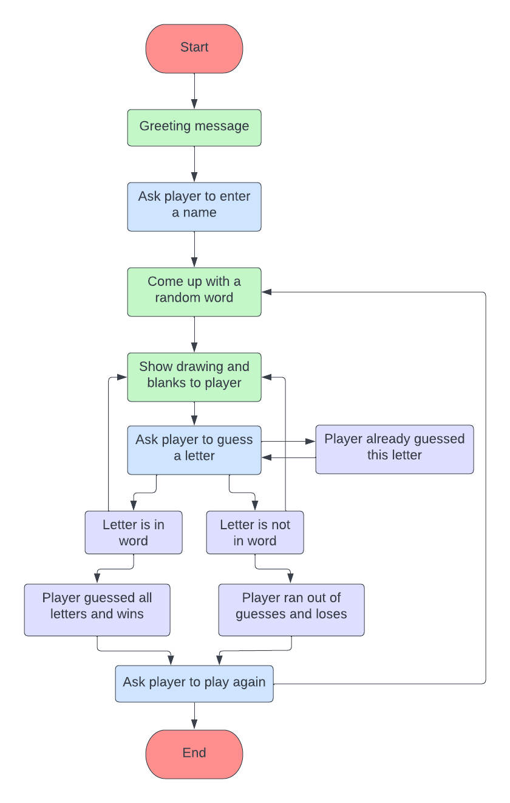
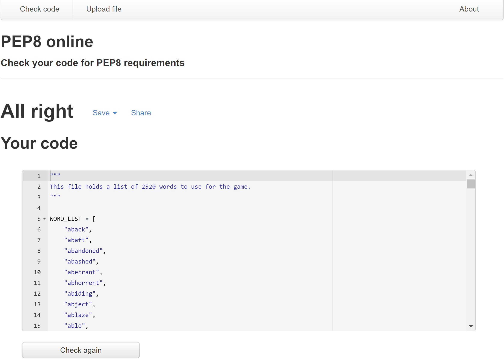
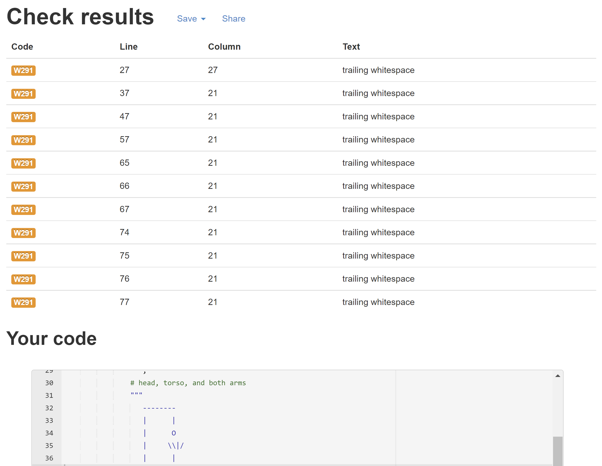
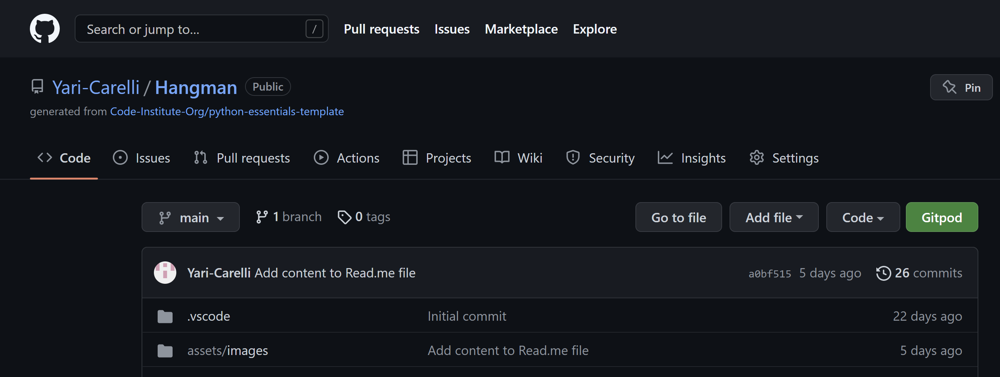
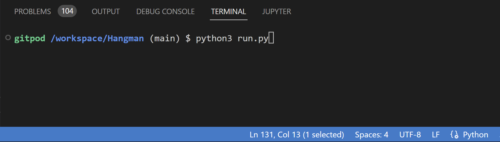

# **[Hangman](https://hangman-yc.herokuapp.com/)**

- [**Overview**](#--overview--)
  * [Program Structure](#--program-structure--)
- [**User Stories**](#--user-stories--)
- [**Features**](#--features--)
  * [Existing Features:](#existing-features-)
    + [Home page:](#--home-page--)
    + [Menu Item 1: Play](#menu-item-1---play--)
    + [Menu Item 2: How To Play](#menu-item-2---rules--)
    + [Menu Item 3: Exit](#menu-item-3---exit--)
  * [Features To Implement:](#features-to-implement-)
- [**Game Logic**](#--game-logic--)
  * [Flowchart](#flowchart)
- [**Data Model**](#--data-model--)
- [**Technologies Used**](#--technologies-used--)
  * [**Language**](#--language--)
  * [**Tools**](#--tools--)
- [**Testing**](#--testing--)
  * [**Code Validation on PEP8**](#--code-validation-on-pep8--)
  * [**Bugs**](#--bugs--)
- [**Deployment**](#--deployment--)
- [**Credits**](#--credits--)
- [**Acknowledgments**](#--acknowledgments--)

##  **Overview**

Hangman is an electronic version of the popular word-guessing game, that runs in a terminal. The objective of the game is to find the word by guessing letters.
The word to guess is represented by a row of dashes representing each letter of the word. If the guessing player suggests a letter which occurs in the word, the program writes it in all its correct positions. If the suggested letter does not occur in the word, the program draws one element of a hanged stick figure as a tally mark.

The player guessing the word may, at any time, attempt to guess the whole word. If the word is correct, the game is over and the guesser wins. Otherwise, the program penalizes the guesser by adding an element to the diagram. On the other hand, if the guesser makes enough incorrect guesses to allow the program to complete the diagram, the guesser loses. However, the guesser can also win by guessing all the letters that appear in the word, thereby completing the word, before the diagram is completed.

To create the list of words stored in the **words.py** file, I actually went on Stack Overflow (https://stackoverflow.com/) and I found this very relevant question [https://stackoverflow.com/questions/594273/how-to-pick-a-random-english-word-from-a-list]. If you scroll down a little, there is a JSON file that is linked. When clicking on that and opening the file, there is a very long list of words that we can use for hangman. So I can simply copy and paste this entire list of English words into a python file (in our case, words.py), and I can assign it to the variable **word_list**, which I can use in our hangman game later.

The live version of the website can be found by clicking [here](https://hangman-yc.herokuapp.com/).

### **Program Structure**

#### **Importing the random module**
The Hangman program randomly selects a secret word for the player to guess from a list of words. The **random module** will provide this ability, so line 17 of the run.py file imports it.

#### **Getting a secret word from the word list**
Line 152 of the run.py file defines the **get_word** function. This function randomly chooses a secret word from the list in **word_list** in the words.py file.

#### **Displaying the board and the secret word with blanks to the player**
Next, I need a function to rpint the hangman board on the screen. It should also display how many letters the player has correctly (and incorrectly) guessed. The **play(word)** function (line 164 of the run.py file) displays the board and the missed letters, and crrates the string of the secret word with all of the not-yet-guessed letters as blanks. I can use the underscore character (_) for this. First, I create a string with nothing but one underscore for eache letter in the secret word. Line 170 of the run.py file defines the **word_completion** variable full of underscores using string replication. Remember that the * operator can be used on a string and an integer, so, for example, the expression "_" * 4 evaluates to "____". This will ensure the 'word_completion' has the same number of underscores as 'word' has letters.

#### **Getting the player's guess**
Line 200 of the run.py file: because Python is case-sensitive, I need to make sure the player's guess is an uppercase letter (or a word in uppercase letters) so I can check it against the secret word. That is where the **upper()** method comes in. Now, even if the player enters a lowercase letter as a guess, the play(word) function returns an uppercase letter.

#### **Leaving the while loop**
Line 193's while loop of the run.py file will keep asking the player for a letter or word until theu enter a single letter or word that hasn't been guessed previously (in case the guess is a word, it must also match the length of the secret word). The code inside the loop also makes sure the player entered  valid guess: a letter or word that has not yet been guessed. If they didn't, the execution will loop back and ask them for a letter or word again.

#### **Asking the player to play again**
The point of line 361's loop of the run.py file is to let the player enter yes or no to tell the program if they want to play another round of Hangman or not. The player should be able to type 'y' in order to mean "yes" or 'n' to mean "no".

------

##  **User Stories**

#### **Main menu**:
- As a user, I should be able to run the program.
- As a user, when running the program, I expect to be invited in the game by displaying a welcome message, the Hangman logo and, below that, the main menu with the three options to choose upon.
- As a user, I should be able to pick one of the three options of the menu.
- As a user, I expect to be repeatedly presented with the main menu and asked to choose among the available options, if I input anyhting other than 1, 2 or 3.
- As a user, I should be able to start the game if I input 1, and then enter a name before actually starting the game.
- As a user, I should be able to view the game rules if I input 2, and be redirected to the main menu if I input r; I expect to be repeatedly asked to input r if I input a different character.
- As a user, I should be able to exit the program if I input 3.

#### **Play the Game**:
- As a user, I should be able to input a letter or a word as a guess.
- As a user, I should be able to see the secret word being revealed as the letters are guessed correctly.
- As a user, I should be able to see the parts of the visual hangman being drawn as incorrect guesses are made.

#### **Ending or Restarting the Game**:
- As a user, I should be able to play the game again by inputting y.
- As a user, I should be able to exit the game by inputting n.

------

##  **Features**
### Existing Features:
#### **Home page**:

Once you are on the **[live site](https://hangman-yc.herokuapp.com/)**, first thing you will notice is the welcome message with the logo of **HANGMAN** ASCII, both in blue, followed by the game menu with 3 options, allowing the player to choose between start the game, view the game's rules, and exit the game.

 

#### **Menu Item 1:** **Play**

When the player chooses the **Play** option, the system will ask the user to enter a name.

Upon entering a name, the program greets the user and wishes them good luck; finally, the word is printed along with the hangman visul at its beginning stage, and the word's length is declared.

Once the user guesses a letter, if the guessed letter is in the word, the program prints a message to inform them and writes the letter in all its correct positions.

If the guessed letter is not in the word, the program prints a message to inform them and draws one element of the hangman visual.

If the user guesses a letter that they have already guessed, the program prints a message to inform them, while asking them to make a different guess.

If the player guesses anything different from a single letter or a word that has the length of the secret word, a **Not a valid input** message is printed.

Upon finishing the game, either winning or losing, the user will have the choice as to whether or not play again.

If the user runs out of tries, the game is over and the program reveals the secret word; a message, which takes the form of a yes/no binary decision, to ask the user to play again is also printed.

If the user guesses all the letters correctly, they win the game, and a "Well Done" ASCII logo in green is printed.

If the user runs out of guesses before the secret word is fully displayed, and all the stages of the hangman visual are drawn, they lose the game, and a **Game Over** ASCII logo in red is printed.

Upon the play again message, if the user inputs **y**, a new game starts.

Upon the play again message, if the user types **n**, a thank you and goodbye message is printed and the game ends.

The player can also choose to input a whole word rather than a single letter as a guess. If the player guesses the word correctly, the program works just as if all the letters in the secret word have been correctly guessed; if the guessed word is wrong, the program works just as if the player has guessed an incorrect letter.

#### **Menu Item 2:** **How To Play**

When the player chooses the **How To Play** option, the system will display a yellow box made in ASCII containing a text, also in yellow, with the instructions to play this interactive version of the hangman game, and right below that, the program will prompt the player to input **r** to return to the main menu.

Upon that, if the player's input is anything different from **r**, an **invalid input** message in red is printed, and the player won't be able to proceed in any way until they input **r**.

If the player inputs **r**, they are redirected to the main menu, which this time is printed alone, without the game logo.

#### **Menu Item 3:** **Exit**

When the player chooses the Exit option, the system will display a goodbye message, and end. You need to click on the “Run Program” button on the top left of the screen to reactivate the program.

 

------

## __Features to implement__

At the moment only the most basic hangman features have been implemented. But there are several ways that the game could be improved, and more functionalities could be added.

* As it is now, upon finishing the first game either winning or losing, the program only allows the user to play the game one more time. At this regard, the loop which allows the user to play the game again could be infinitely iterated, rather than just once, until the user decides to exit the game. 

* In the future I hope to add more features where players can interact more with the game by adding their own vocabularies for others to use and to keep statistics on their games.

* At the moment, the game is a single-player experience, and no scores are recorded. It could be possible to store the scores in a document, that could then be accessed by different players.

* Larger selection of words to be stored ina Google sheet and be integrated via API.

* Scoreboard for the user to view how many games they have won and lost.

* Some modifications to gameplay (house rules) to increase the difficulty level could be implemented, such as limiting guesses on high-frequency consonants and vowels.

* Another alternative is to give the definition of the word; this can be used to facilitate the learning of a foreign language.

## **Game Logic**
### **Flowchart**

* This flowchart was created with https://lucidhart.com/, in order to demonstrate how the program would function.
There is no one correct way to make a flowchart; as long as you understand your flowchart, it will be helpful when you start coding. Always begin your flowchart with a **Start** and an **End** box.
This flowchart simply shows what happens when you play Hangman.
First, the computer thinks of a secret word. Then the player guesses letters.
The program needs to check whether the guessed letter is in the secret word.
There are two possibilities: the letter is either in the word or not. If the letter is in the secret word, check wheter the player has guessed all the letters and won the game. If the letter is not in the secret word, check whether the hanging man is complete and the player has lost.
Once the player has won or lost, the program asks them if they want to play again with a new secret word. If the player doesn't want to play again, the program ends. Otherwise, the program continues and thinks up a new secret word.
The player doesn't guess a letter just once; they keep guessing letters until they win or lose. The dashed arrows in the flowchart show the player can guess again. What if the player guesses the same letter again? Rather than counting this letter again, allow them to guess a different letter.
If the player guesses the same letter twice, the flowchart leads back to the **Guess a letter** box.
The player needs to know how they are doing in the game. The program should show them the hanging man drawing and the secret word (with blanks for the letters they haven't guessed yet). These visuals will let them see how close they are to winning or losing the game.
This information is updated every time the player guesses a letter. I have added a **Show drawing and blanks to player** box to offer the player feedback.
This flowchart completely maps out the order of everything that can happen in the Hangman game, and it helped me remember everything I needed to code.

 

------

## **Technologies Used**
### **Language**
This is a command-line application built purely using **python** as the main programming language.

### **Tools**
- [Github](https://github.com/) for store and version control of the code

- [Gitpod](https://gitpod.io/workspaces) for editing code

- [Heroku](https://heroku.com/) for deployment

- [Lucidhart](https://lucidhart.com/) for creating flowchart

- [Patorjk.com](https://patorjk.com/software/taag/#p=display&f=Star%20Wars&t=Type%20Something%20) for creating the cool looking HANGMAN logo at the beginning of the game, and the WELL DONE logo and GAME OVER logo, which are respectively displayed upon winning or losing the game

- [Amiresponsive.com](https://ui.dev/amiresponsive) for generating the mock-up

 

------

## **Testing**

### **Test Cases**

- Step 1: When clicking on the **Run Program** orange button on the top left-hand corner, the screenshot below shows the expected output:

- Step 2.1: When the user inputs 1, the screenshot below shows the expected output:

- Step 2.2: When the user enters a name, the screenshot below shows the expected output:

- Step 2.3: When the user inputs a correct letter as a guess, the screenshot below shows the expected output:

- Step 2.4: When the user inputs an incorrect letter as a guess, the screenshot below shows the expected output:

- Step 2.5: When the user inputs an invalid character as a guess, the screenshot below shows the expected output:

- Step 2.6: When the user inputs a letter they have already guessed, the screenshot below shows the expected output:

- Step 2.7: When the user inputs a valid word as a guess, the screenshot below shows the expected output:

- Step 2.8: When the user inputs an invalid word as a guess, the screenshot below shows the expected output:

- Step 2.9: When the user guesses the word correctly, the screenshot below shows the expected output:

- Step 2.10: When the user runs out of tries, the screenshot below shows the expected output:

- Step 2.11: When the user inputs 'y' to play the game again, the screenshot below shows the expected output:

- Step 2.12: When the user inputs 'n' to end the game, the screenshot below shows the expected output:

- Step 3.1: When the user inputs 2, the screenshot below shows the expected output:

- Step 3.2: When the user inputs 'r', the screenshot below shows the expected output:

- Step 3.3: When the user inputs anything different from 'r', the screenshot below shows the expected output:

- Step 4: When the user inputs 3, the screenshot below shows the expected output:

### **Code Validation on PEP8**
* Both the run.py file and the words.py file have passed through the PEP8 Online Validator without any issues.
As regards as the hangman_visual.py file, checking through the PEP8 Validator resulted in some "trailing whitespace", which have been deliberately ignored as they allow the drawing in ASCII to be fully functional.

run.py

words.py

hangman_visual.py

 

------

## __Bugs__

* To the best of my knowledge, no bugs exist in the website in its current state.

 

------

## **Deployment**
This application has been deployed to Heroku. The deployment process is described below:

- Login on the [Heroku](https://id.heroku.com/login) website, [create](https://signup.heroku.com/login) your free account if you don’t have one already.

- On your dashboard, click on the **New** button on the top right-hand corner, and then click on **Create new app**.

- Next, type in your project name, which has to be unique, then choose your region and click on **Create App**.

- You will come to the next screen, and we will set the **Settings** first and then **Deploy**.

- In the **Settings**, Scroll down until you reach **Config Vars**, and click on the button **Reveal Config Vars**.

- In the **KEY** section type **PORT** (it MUST be in capital letters) and in the **VALUE** section **8000**.

- Then you will scroll down and add two buildpacks in the **Settings**, first **Python** and second **Node.js**. Be aware of the order of these two, it has to be exactly like this (Python first and Node.js second), otherwise it will cause problems when we deploy the project.

- That's all the settings we need to do. Now let's go to the **Deploy** tab. In the deployment method, I connected my Github account, for this project. You must type in the name of your repository in order for it to be connected.

- At the bottom of the page, choose **Manual deploy**, and then click on the **Deploy Branch** button.

- The deployment process will start and will take a few minutes.

- When the deployment has completed, it will display the message **"Your app was successfully deployed"** with a **View** button below the message, which will take you to your deployed site by clicking on it.

 

------

## __Local Deployment__

Instructions to run the program from the Terminal or Command Prompt:
- Open the repository in Gitpod by clicking on the **green button** on the top right-hand of the screen:

- To start, you need to make sure the command line application you are using has access to your Python installation. To do this, open the command prompt, type **python** and press ‘Enter’. You should see a message that documents the Python version that is being used followed by >>>, which indicates the next code you type will be executed by the Python interpreter.
- All you need to do is type **python3** followed by the script name (**run.py**). The command-line to run the program will therefore be:
`python3 run.py`

To run a backend Python file, type `python3 app.py`, if your Python file is named `app.py` of course.
If you would like to make a clone of this repository, you can type the following command in your IDE terminal:

- `git clone https://github.com/Yari-Carelli/Hangman`

Alternatively, if using Gitpod, you can click below to create your own workspace using this repository.

 

------

## **Credits**

- Tutor support from Code Institute for helping me out when I got stuck.

- [Stackoverflow](https://stackoverflow.com/) for researching a list of things.

- [GeeksforGeeks](https://www.geeksforgeeks.org/hangman-game-python/) to boost understanding logic.

- Follow this link if you would like to better understand a common conditional statement in Python: **if __name__ == "__main__"**, which I have used at the end of my code. This conditional is used to check whether a python module is being run directly or being imported. (https://www.youtube.com/watch?v=sugvnHA7ElY&list=PLOOi_ijj0anO_Vm7KHHBFkQY1bcxgdQq2&index=8)

- This tutorial by Kylie Ying was useful to understand the thought process of the program. Jump to minute **24:25** for **Hangman**: (https://www.youtube.com/watch?v=8ext9G7xspg&t=1465s)

Small tip: when deciding to follow a tutorial, go to the end of the tutorial and see the final output, then try coding the whole thing by yourself. It forces you to build the thing from scratch, and when you get stuck, just rewind and see how it they build it.

 

------

## **Acknowledgments**
* I would like to acknowledge the help provided to me by various people and websites, who have rendered the task of making this website easier, and in some cases, possible. In no particular order, I would like to thank:
   * w3schools.com, whose tutorials on Python were a frequent reference for all matter of questions both large and small;
   * stackoverflow.com, whose forums provided me with many helpful answers to problems I was experiencing when writing my code, and offered good examples for me to compare my code against;
   * The Slack community of Code Institute, a consistent source of warmth and encouragement, especially when I felt I was hitting my head against a wall;
   * The Code Institute tutor system, who were able to gently push me into the right direction when I felt like I had expended my last reserves of patience on some issues;
   * My mentor Rohit Sharma, who was as wonderful as ever in setting me straight;
   * And lastly, my friends and family who play-tested the application in its various iterations.
