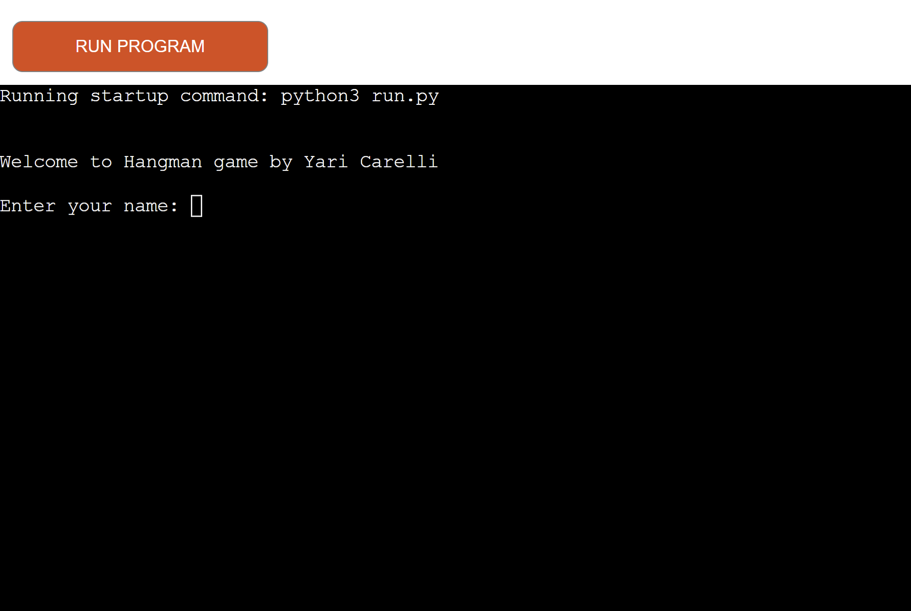
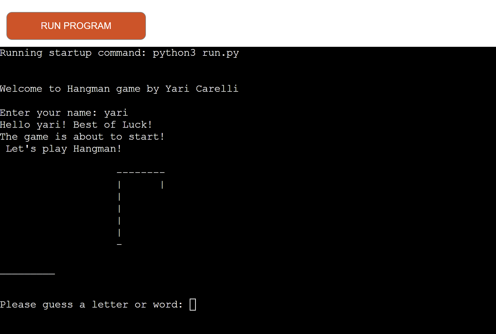
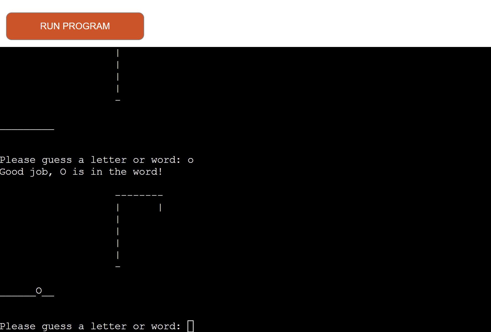
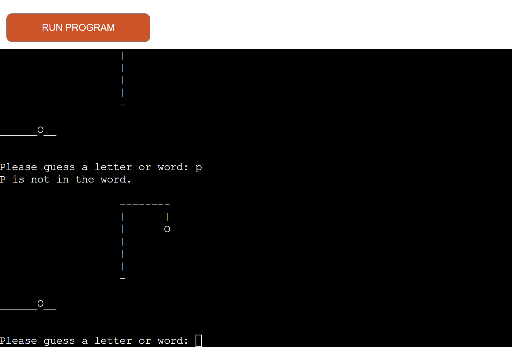
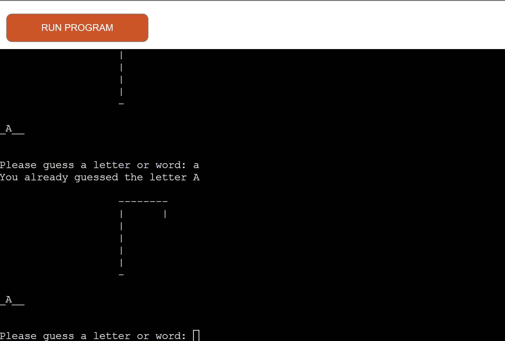
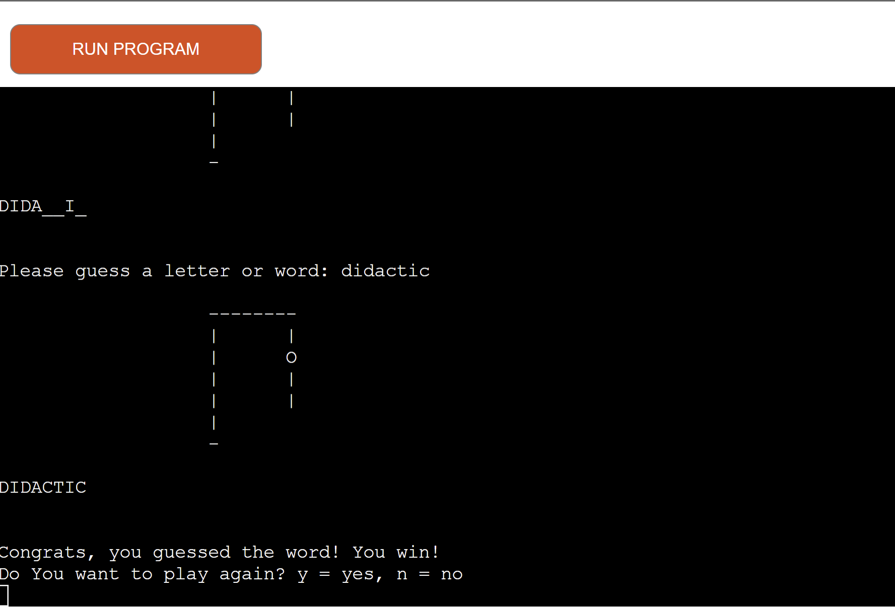
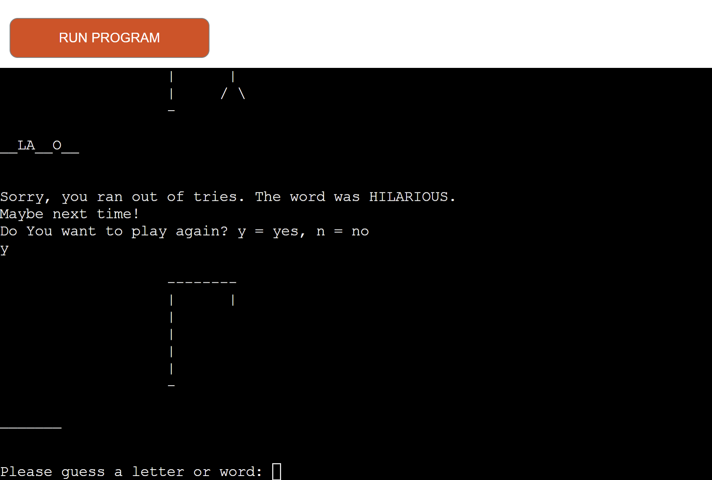
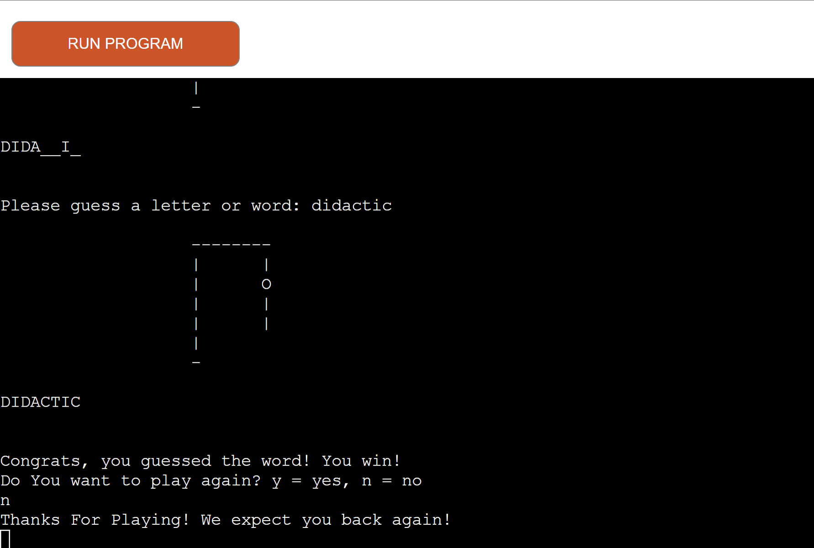
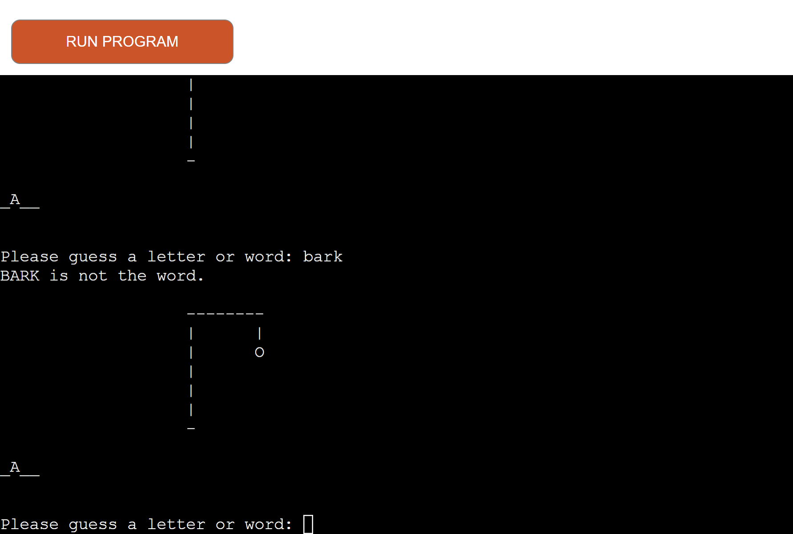

# Hangman

##  __Overview__

Hangman is an electronic version of the popular word-guessing game, that runs in a terminal. The objective of the game is to find the word by guessing letters.
The word to guess is represented by a row of dashes representing each letter of the word. If the guessing player suggests a letter which occurs in the word, the program writes it in all its correct positions. If the suggested letter does not occur in the word, the program draws one element of a hanged stick figure as a tally mark.

The player guessing the word may, at any time, attempt to guess the whole word. If the word is correct, the game is over and the guesser wins. Otherwise, the program penalizes the guesser by adding an element to the diagram. On the other hand, if the guesser makes enough incorrect guesses to allow the program to complete the diagram, the guesser loses. However, the guesser can also win by guessing all the letters that appear in the word, thereby completing the word, before the diagram is completed.

The live version of the website can be found by clicking [here](https://hangman-yc.herokuapp.com/).

##  __Features__

The game features a welcome message along with the name input:

Upon entering a name, the program greets the user and wishes them good luck; finally, the word is printed and its length is declared:

Once the user guesses a letter, if the guessed letter is in the word, the program prints a message to inform them and writes the letter in all its correct positions:

If the guessed letter is not in the word, the program prints a message to inform them and draws one element of the hangman visual:

If the user guesses a letter that they have already guessed, the program prints a message to inform them, while asking them to make a different guess:

Upon finishing the game, either winning or losing, the user will have the choice as to whether or not play again.

If the user runs out of tries, the game is over and the program reveals the secret word; a message to ask the user to play again is also printed:

If the user guesses all the letters correctly, they win the game; a message to ask the user to play again is printed:

Upon the play again message, if the user inputs y, a new secret word is printed and its length is declared:

Upon the play again message, if the user types n, a thank you and goodbye message is printed and the game ends:

The player can also choose to inert a whole word:

## __Features to implement__

There are several ways that the game could be improved, and more functionalities could be added:

* At the moment, the game is a single-player experience, and no scores are recorded. It could be possible to store the scores in a document, that could then be accessed by different players.

* Some modifications to gameplay (house rules) to increase the difficulty level could be implemented, such as limiting guesses on high-frequency consonants and vowels.

* Another alternative is to give the definition of the word; this can be used to facilitate the learning of a foreign language.

## __Flowchart__

* This flowchart was created with lucidchart.com, in order to demonstrate how the program would function:

## __Technologies Used__

  * Python is the language that the game was coded in.
  * The application is deployed on Heroku.
  * The repository is hosted on GitHub.
  * Gitpod was the workspace used to code and build the content of the website, which would then be committed to GitHub.
  * Git was used for version control.

## __Testing__

* Both the run.py file and the words.py file have passed through the PEP8 Online Validator without any issues:

## __Bugs__

* To the best of my knowledge, no bugs exist in the website in its current state.

##  __Deployment__

* This application has been deployed to Heroku. The deployment process is described below:

* Log in to your Heroku account and, once on the dashboard, click on the new button in the top right-hand corner, then click 'create new app'

* You must now choose a name for your app, which must be unique, and the appropriate region.

* On the next page, you will see the Github logo. As my repository is stored there, I connected it to my github account.

* You must then type in the name of your repository in order for it to be connected.

* Once that is done, click on the settings tab at the top.

* Scroll down until you reach config vars and click on the button 'Reveal Config Vars'.

* In the key section type 'PORT' (it MUST be in capital letters) and in the value section 8000.

* Next, select buildpacks and add python and nodejs (they must be added in this order).

* Now, go back to the deploy tab and scroll down until you see this button. Click 'Deploy Branch'.

* You should see the terminal working while it deploys.

* If everything has been successful, by clicking 'View' you will be able to see the app running in a new tab.

## __Local Deployment__

If you would like to make a clone of this repository, you can type the following command in your IDE terminal:

- `git clone https://github.com/Yari-Carelli/Hangman`

Alternatively, if using Gitpod, you can click below to create your own workspace using this repository.

## __Acknowledgements__

* I would like to acknowledge the help provided to me by various people and websites, who have rendered the task of making this website easier, and in some cases, possible. In no particular order, I would like to thank:
   * w3schools.com, whose tutorials on Python were a frequent reference for all matter of questions both large and small;
   * stackoverflow.com, whose forums provided me with many helpful answers to problems I was experiencing when writing my code, and offered good examples for me to compare my code against;
   * The Slack community of Code Institute, a consistent source of warmth and encouragement, especially when I felt I was hitting my head against a wall;
   * The Code Institute tutor system, who were able to gently push me into the right direction when I felt like I had expended my last reserves of patience on some issues;
   * My mentor Rohit Sharma, who was as wonderful as ever in setting me straight;
   * And lastly, my friends and family who play-tested the application in its various iterations.